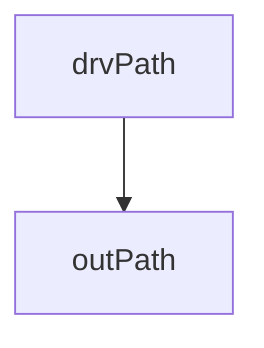

# Nix

How to build software from the future


---
src: /pages/what_is_nix.md
---


---
layout: center
---

# Core Idea of Nix

<br/>
<br/>

> Everything on your computer implicitly depends on a bunch of other things on your computer

<br/>
<br/>

<v-clicks>

- All software is a graph of dependencies
- This graph is mostly implicit
- Nix forces this graph to be explicit

</v-clicks>

---
layout: center
---


---
layout: center
---


---
layout: center
---

# Four key ideas:

<v-clicks>

- Store
- Language
- Derivation
- Sandboxing

</v-clicks>

---
layout: two-cols
---

# The Nix Store

<br/>

<v-clicks>

When nix is installed, a special directory, `/nix/store` is created

This directory is just a graph database

Every sub-directory is a node

<div>

Example:

```bash
/nix/store/q1i8hccfgx0al5jhx5n610jwwqa3jijx-git-2.38.1
```

</div>

Inside a **node** are the build artifacts - e.g, the `git` binary

`/nix/store/q1i8hccfgx0al5jhx5n610jwwqa3jijx-git-2.38.1/bin/git`

Also, there may be references to paths in other nodes, creating edges/vertices

</v-clicks>

::right::

```bash
/nix/store/9xfad3b5z4y00mzmk2wnn4900q0qmxns-glibc-2.35-224
/nix/store/f1n473kbcxxr38f7amwf4sxyi56mfczh-expat-2.5.0
/nix/store/fblaj5ywkgphzpp5kx41av32kls9256y-zlib-1.2.13
/nix/store/wim4mqpn8lxhhr10p2kd070hyj152lil-bash-5.1-p16
/nix/store/65cp4izx3bllnwqn7c7dhrq9h9gmjkal-python3-3.10.9
/nix/store/88k0f4k4hb13mjqm1xc0sysjysrrw813-gzip-1.12
/nix/store/8n4g9jl8s2v8sla6gffa03gy1gkk1pqm-perl5.36.0-URI-5.05
/nix/store/a19azdhwnvmksbpfz0crb4d1l9l19b2d-git-2.38.1-doc
/nix/store/ncwm1bgg4x4k7ixjni5bxj3v7b2x5lyb-perl5.36.0-FCGI-0.79
/nix/store/k32xzhjqyvgmjnkckvk2h3gbjpdb3hfl-perl5.36.0-HTML-Parser-3.75
/nix/store/w2gxv2p9831ypflpk61l7sjzi8j05agj-perl5.36.0-CGI-4.51
/nix/store/a509h53d4vki546clzig63kh6h4qyps4-perl5.36.0-CGI-Fast-2.15
...
...
/nix/store/xryxkg022p5vnlyyyx58csbmfc7ydsdp-curl-7.86.0
/nix/store/z6976dw306w5fn1d4sg7xwc1x3cszy1s-perl5.36.0-FCGI-ProcManager-0.28
/nix/store/z97bsdbkh6b60xpi12sqi6a0d28ql8cy-pcre2-10.40
/nix/store/q1i8hccfgx0al5jhx5n610jwwqa3jijx-git-2.38.1
```

<sub>Some of the direct dependencies for git in `/nix/store`</sub>


---
layout: center
---

<code>
/nix/store/<b>q1i8hccfgx0al5jhx5n610jwwqa3jijx</b>-git-2.38.1
</code>

<br/>
<br/>

<v-clicks>

Every node has a unique hash

For a given hash, the contents of that node will always be identical, across machines, platforms, etc

If the hash differs, then the contents differs

> Note: A node can also be referred to as an `outputPath`, which will be important later

</v-clicks>

---
layout: center
---

The Nix Store is a graph database

<v-clicks>

More specifically a **directed acyclic graph** database

And we get to query it like a database

<div>

```bash
# List's all the direct dependencies of git
nix-store --query --references /nix/store/q1i8hccfgx0al5jhx5n610jwwqa3jijx-git-2.38.1

# Models the "transitive closure" of the git dependency graph
nix-store --query --graph /nix/store/q1i8hccfgx0al5jhx5n610jwwqa3jijx-git-2.38.1 | dot -Tsvg
```

</div>

</v-clicks>


---
layout: two-cols
---

# Nix Derivations

#### Derivation structure

<br/>
<br/>

<table v-if="$slidev.nav.clicks >= 1">
  <tr></tr>
  <tr v-if="$slidev.nav.clicks >= 1">
    <td>outputs</td>
    <td>What nodes can this build?</td>
  </tr>
  <tr v-if="$slidev.nav.clicks >= 2">
    <td>inputDrvs</td>
    <td>Other derivations which must be built before this one</td>
  </tr>
  <tr v-if="$slidev.nav.clicks >= 3">
    <td>inputSrcs</td>
    <td>Nodes already in the Nix Store which this build depends</td>
  </tr>
  <tr v-if="$slidev.nav.clicks >= 4">
    <td>platform</td>
    <td>x86_64-linux, aarch64-darwin, ...</td>
  </tr>
  <tr v-if="$slidev.nav.clicks >= 5">
    <td>builder</td>
    <td>Program to run to do the build</td>
  </tr>
  <tr v-if="$slidev.nav.clicks >= 6">
    <td>args</td>
    <td>Argument to pass to the builder program</td>
  </tr>
  <tr v-if="$slidev.nav.clicks >= 7">
    <td>env</td>
    <td>Environment to set before calling the builder</td>
  </tr>
</table>

::right::

<br/>
<br/>
<br/>
<br/>
<br/>
<br/>
<br/>

```bash {all|4|5|6|7|8|9|10,11,12,13,14,15}
$ cat /nix/store/856p...gdl5-demo.drv

Derive(
  [("out","/nix/store/vy11....nc34-demo","","")],
  [("/nix/store/0lj5...30xs-bash-5.1-p16.drv",["out"])],
  [],
  "x86_64-linux",
  "/nix/store/iffl...1kmi-bash-5.1-p16/bin/bash",
  ["-c","echo \"Hello World!\" > $out\n"],
  [
    ("builder","/nix/store/iffl...1kmi-bash-5.1-p16/bin/bash"),
    ("name","demo"),
    ("out","/nix/store/vy114...9nc34-demo"),
    ("system","x86_64-linux")
  ]
)
```

---
layout: two-cols
clicks: 2
---

# Nix Derivations

<br/>
<br/>
<br/>
<br/>
<br/>
<br/>

A derivation is a recipe to build some other path in the Nix Store

It's just a file of build instructions

<table v-if="$slidev.nav.clicks >= 1">
  <tr></tr>
  <tr v-if="$slidev.nav.clicks >= 1">
    <td>drvPath</td>
    <td>Recipe file containing build instructions</td>
  </tr>
  <tr v-if="$slidev.nav.clicks >= 2">
    <td>outPath</td>
    <td>Location of build artifacts</td>
  </tr>
</table>

::right::

<br/>
<br/>
<br/>
<br/>




---


Essentially .drv files are just a fancy json

```bash
nix show-derivation /nix/store/856pm4kv8ddsr0qnbjzprpfm7sbfgdl5-demo.drv
```

```json{all|5}
{
  "/nix/store/856pm4kv8ddsr0qnbjzprpfm7sbfgdl5-demo.drv": {
    "outputs": {
      "out": {
        "path": "/nix/store/vy114fkxdsw4fb7ysfp86p8l32z9nc34-demo"
      }
    },
    "inputSrcs": [],
    "inputDrvs": {
      "/nix/store/0lj5m63bn3ins5qiq6chs1vz3nk030xs-bash-5.1-p16.drv": [
        "out"
      ]
    },
    "system": "x86_64-linux",
    "builder": "/nix/store/iffl6dlplhv22i2xy7n1w51a5r631kmi-bash-5.1-p16/bin/bash",
    "args": [
      "-c",
      "echo \"Hello World!\" > $out\n"
    ],
    "env": {
      "builder": "/nix/store/iffl6dlplhv22i2xy7n1w51a5r631kmi-bash-5.1-p16/bin/bash",
      "name": "demo",
      "out": "/nix/store/vy114fkxdsw4fb7ysfp86p8l32z9nc34-demo",
      "system": "x86_64-linux"
    }
  }
}
```

---
layout: center
---

Just like the node it builds, it's transitive closure is also explicitly defined

```bash
nix-store --query --graph /nix/store/856pm4kv8ddsr0qnbjzprpfm7sbfgdl5-demo.drv \
  | dot -Tsvg > graph.svg && feh graph.svg
```

<v-click>

Everything* in the Nix Store, except derivations are created using derivations

</v-click>

---
layout: center
---

Derivations are built using some variant of the `nix-build`/`nix build` command

<v-clicks>

```bash
$ nix-build /nix/store/856pm4kv8ddsr0qnbjzprpfm7sbfgdl5-demo.drv # legacy
```

or

```bash
$ nix build /nix/store/856pm4kv8ddsr0qnbjzprpfm7sbfgdl5-demo.drv --print-output-paths # newer > nix-2.4
```

producing the `outPath`

```bash
/nix/store/vy114fkxdsw4fb7ysfp86p8l32z9nc34-demo # The node outpath
```

verifying the build went correctly

```bash
$ cat /nix/store/vy114fkxdsw4fb7ysfp86p8l32z9nc34-demo

Hello World!
```

</v-clicks>


---
layout: two-cols
---

## How are the hashes generated then?

<br/>

<v-clicks>

This is particularly low-level so I'm going to keep it simple

For a **derivation** hash, it typically is just the sha256 or md5 of the derivation contents

For an **output** hash, it typically is the sha256 or md5 of the derivation hash + the output name ("out")

So if we change the version of the bash dependency stated in the derivation, the derivation hash will change

Which will propagate a change to the output hash

This turns each unique package node in the Nix Store and it's children dependencies into a merkle-tree structure

</v-clicks>

::right::


<br/>
<br/>
<br/>
<br/>
<br/>
<br/>


---
layout: center
---

By this method, we create a unique fingerprint on <ins>how</ins> a piece of software is built

<v-clicks>

Not *always* a unique fingerprint on <ins>what</ins> software is built, byte-for-byte equality is not always the case across two separate builds

However if the `builder` program is deterministic in how it builds the program, it is

Content-address hashing, which would give this byte-for-byte property, is currently in the Nix development pipeline

</v-clicks>

---
layout: center
---

# Hermeticity

---

# Pure vs Hermetic

<br/>
<br/>
<br/>

Nix is often described as a <ins>pure</ins> functional package manager

<v-clicks>

Which is not untrue

Instead of pure it's more precise to say it's <ins>**hermetic**</ins>

**Pure** in this context means that some program for some input will emit the same output

And that no _side-effects_ are created

This is generally true and the desired goal of Nix

Hermetic is more accurate

</v-clicks>

---
layout: two-cols
---

# Hermeticity

<br/>
<br/>
<br/>
<br/>
<br/>

Rooted from the Greek god, Hermes, who amongst other things was the god of boundaries

<v-clicks>

In more scientific contexts it means the concept of being **airtight** or **gastight**

In software, it means a program which is <ins>fully independent</ins> or <ins>isolated</ins>

</v-clicks>

::right::


---
layout: center
---

# All Nix builds are hermetic

<br/>

<v-clicks>

Builds are executed in an isolated _"sandbox"_

All builds are done by a special user called `nixbld`

Which only has access to content in the Nix Store

The build runtime is executed in a "chrooted" environment

Access to the network and the external host filesystem is restricted (some caveats)

TLDR: something similar to Docker

</v-clicks>

---

# Dependency closure of `git`


<v-clicks>

All dependencies are explicitly known

Nothing is machine dependent

Extremely strong guarantees of reproducibility

Entire dependency closure can be copied to another machine (that can execute x86_64-linux binaries)

</v-clicks>

---
layout: center
---

### Things either work everywhere and always or nowhere and never

---
layout: center
---


---
layout: center
---

### With Nix any software build/install can be a binary download - period

<br/>

<v-clicks>

- Once a package derivation has been built somewhere on some machine
- That graph can be compressed, copied and dumped directly into your nix store - in parallel
- This makes things extremely fast
- [Cachix](https://www.cachix.org/) is a binary cache which enable this

</v-clicks>

---
layout: center
---

## The Nix Language

---
layout: center
---

- Probably the most challenging part for people new to Nix

<v-clicks>

- Weird syntax, similarities to Haskell, dynamically typed
- It's a <ins>D</ins>omain <ins>S</ins>pecific <ins>L</ins>anguage
- Functional, pure and lazy - we'll talk about this

</v-clicks>

---
layout: two-cols
---

### Nix is <ins>functional</ins>, pure and lazy

Everything is either a function or data

<v-clicks>

```nix
addOne = x: x + 1;
```

<div>
<br/>

```nix
{
  string = "hello";
  integer = 1;
  float = 3.141;
  bool = true;
  null = null;
  list = [ 1 "two" false ];
  attribute-set = {
    a = "hello";
    b = 2;
    c = 2.718;
    d = false;
  }; # comments are supported
}
```
</div>

</v-clicks>

::right::

<br/>

<v-clicks>

Core language is very small

```nix
nix-repl> builtins.

builtins.abort                          builtins.isAttrs
builtins.add                            builtins.isBool
builtins.addErrorContext                builtins.isFloat
builtins.all                            builtins.isFunction
builtins.any                            builtins.isInt
builtins.appendContext                  builtins.isList
builtins.attrNames                      builtins.isNull
builtins.attrValues                     builtins.isPath
builtins.baseNameOf                     builtins.isString
builtins.bitAnd                         builtins.langVersion
builtins.bitOr                          builtins.length
builtins.bitXor                         builtins.lessThan
builtins.break                          builtins.listToAttrs
builtins.builtins                       builtins.map
builtins.catAttrs                       builtins.mapAttrs
builtins.ceil                           builtins.match
builtins.compareVersions                builtins.mul
builtins.concatLists                    builtins.nixPath
builtins.concatMap                      builtins.nixVersion
builtins.concatStringsSep               builtins.null
builtins.currentSystem                  builtins.parseDrvName
builtins.currentTime                    builtins.partition
builtins.deepSeq                        builtins.path
builtins.derivation                     builtins.pathExists
builtins.derivationStrict               builtins.placeholder
builtins.dirOf                          builtins.readDir
builtins.div                            builtins.readFile
builtins.elem                           builtins.removeAttrs
builtins.elemAt                         builtins.replaceStrings
builtins.false                          builtins.scopedImport
builtins.fetchGit                       builtins.seq
builtins.fetchMercurial                 builtins.sort
builtins.fetchTarball                   builtins.split
builtins.fetchTree                      builtins.splitVersion
builtins.fetchurl                       builtins.storeDir
builtins.filter                         builtins.storePath
builtins.filterSource                   builtins.stringLength
builtins.findFile                       builtins.sub
builtins.floor                          builtins.substring
builtins.foldl'                         builtins.tail
builtins.fromJSON                       builtins.throw
builtins.fromTOML                       builtins.toFile
builtins.functionArgs                   builtins.toJSON
builtins.genList                        builtins.toPath
builtins.genericClosure                 builtins.toString
builtins.getAttr                        builtins.toXML
builtins.getContext                     builtins.trace
builtins.getEnv                         builtins.traceVerbose
builtins.getFlake                       builtins.true
builtins.groupBy                        builtins.tryEval
builtins.hasAttr                        builtins.typeOf
builtins.hasContext                     builtins.unsafeDiscardOutputDependency
builtins.hashFile                       builtins.unsafeDiscardStringContext
builtins.hashString                     builtins.unsafeGetAttrPos
builtins.head                           builtins.zipAttrsWith
builtins.import
builtins.intersectAttrs
```

</v-clicks>

---
layout: center
---

### Nix is functional, pure and <ins>lazy</ins>

<v-clicks>

Lazy/Laziness/Lazy-evaluation just means where <br/>
an expression is evaluated only when it's values are needed

<div>

Suppose:

```nix
let
  data = {
    a = 1;
    b = functionWhichTakesALongTimeToRun 1;
  }
in data.a
```

</div>

`data.b` is never evaluated in Nix

`data.a => 1` is evaluated immediately

</v-clicks>

---
layout: center
---

### Nix is functional, <ins>pure</ins> and lazy

<v-clicks>

We talked a little about this already

Pure as in free of side effects

</v-clicks>

<v-clicks>

- no networking
- no user IO
- no writing to file
- no output
- doesn't actually do anything, in the traditional sense
- Only purpose is to call the `derivation` function
- The only side-effect as it write's a derivation a path in the nix store

</v-clicks>

---
layout: center
---

### The Nix language only does one thing

<br/>

<v-clicks>

```nix
derivation {
  name = "demo";
  system = "x86_64-linux";
  builder = "${pkgs.bash}/bin/bash";
  args = ["-c" "echo \"Hello World!\" > $out"];
}
```

When a derivation function like this is evaluated we (roughly) get:

```nix{all|2,3,4,5|6,7|all}
{
  name = "demo";
  system = "x86_64-linux";
  builder = "${pkgs.bash}/bin/bash";
  args = ["-c" "echo \"Hello World!\" > $out"];
  drvPath = "/nix/store/856pm4kv8ddsr0qnbjzprpfm7sbfgdl5-demo.drv";
  outPath = "/nix/store/vy114fkxdsw4fb7ysfp86p8l32z9nc34-demo";
}
```

<div>

<br/>

> The Nix language does not do anything except write out derivations, <br/> for which other tooling (`nix-build`) can execute a build

</div>

Evaluation of the Nix language is a separate process of building a Nix derivation

</v-clicks>

---
layout: center
---

So if a given `.nix` file to build some package has stated 100 dependencies

<v-clicks>

The evaluation of that file will recursively write 100 derivations

And then the derivation (_root_) of that package will then be written

The _root_ derivation can then be called by `nix-build` or the like

That dependency graph is traversed again, recursively building 100 dependencies to their outPaths

And finally the _root_ derivation is built to it's outPath utilising all those explicitly stated deps

</v-clicks>

---
layout: center
---


Building software is arbitrarily complex

<v-clicks>

Nix reduces that to just individual derivations

Which expresses the build instructions of a massively complex piece

That is reproducible and reliable

</v-clicks>


---
layout: center
---

The Nix language enables complex descriptions of how to build a piece of software

<v-clicks>

Typically a package manager will only provide only one or a few variants of a given package

Crafting a nix package becomes analogous to creating an API to build that package for every variant

If we look at how [`curl`](https://github.com/NixOS/nixpkgs/blob/nixos-22.11/pkgs/tools/networking/curl/default.nix#L185) is packaged

There's a lot of interesting possibilities to build systems with nix

</v-clicks>

---
layout: center
clicks: 6
---

## [Nixpkgs](https://github.com/NixOS/nixpkgs/tree/nixos-22.11)

Global package repository for Nix

<v-clicks>

One of the most active repositories on Github

Always community contributions

Huge, ~95,000 pkgs (depends which branch)

</v-clicks>

<br/>

<table v-if="$slidev.nav.clicks >= 4">
  <tr>
    <th>Branch</th>
    <th>Description</th>
  </tr>
  <tr v-if="$slidev.nav.clicks >= 4">
    <td>nixos-21.11</td>
    <td>Current stable, bi-yearly releases, akin to Ubuntu LTS examples</td>
  </tr>
  <tr v-if="$slidev.nav.clicks >= 5">
    <td>unstable</td>
    <td>Daily rolling release, pretty "bleeding edge", akin to Arch</td>
  </tr>
  <tr v-if="$slidev.nav.clicks >= 6">
    <td>master</td>
    <td>As up to date as possible, can be broken, comes with warning signs</td>
  </tr>
</table>

---
layout: center
---

Nixpkgs is just a big attrset of lazy-evaluated calls to `derivation`

<v-clicks>

 \>95,000 lazy calls to derivation

```
{
  python = derivation { ... }
  rust = derivation { ... }
  nginx = derivation { ... }
  curl = derivation { ... }
  linux_kernel = derivation { ... }
  .
  .
  .
}
```


</v-clicks>

---
layout: two-cols
---

<br/>
<br/>
<br/>
<br/>


::right::

<br/>
<br/>
<br/>
<br/>
<br/>
<br/>


## That's Nix fundamentals

<v-clicks>

There are more things to randomly cover:

</v-clicks>

<v-clicks>

- Ephemeral shells
- Nix flakes
- Hermetic developer environments
- CI
- Nix & Docker
- NixOS
- ... and many more

</v-clicks>

---

## Ephemeral shells

<br/>

### nix-shell

<v-clicks>

Often people will read about nix and hear about `nix-shell` - it's really useful

`nix-shell`, is just a wrapper around `nix-build` but will jump you into a new shell environment

You can specify a package to be downloaded and be added to your shell `PATH`, e.g

```bash
nix-shell -p nodejs-16_x
```

This is very ergonomic for one-time-use of a specific package

But you can utilise a shell.nix file for an automatic 'semi-virtual' environment

```nix
{ pkgs ? import <nixpkgs> {} }:
  pkgs.mkShell {
    # nativeBuildInputs is usually what you want -- tools you need to run
    nativeBuildInputs = with pkgs; [ nodejs-16_x ];
}
```

</v-clicks>

---

## Nix Flakes

<v-clicks>

Relatively new-addition to the Nix ecosystem

Analogous to the role `cargo.toml` and `package.json` serve in a rust or javascript based project

In Nix based workflows, you would specify a `flake.nix`

Vastly simplifies how nix based projects can be composed

Still _"experimental"_ but becoming the de-facto standard

Enables any github repo publish a set of derivations like nixpkgs

But it allows more cool stuff

It's divided into two parts, an "input" schema and an "output" schema

</v-clicks>

---
layout: two-cols
---

## Nix Flakes

<br/>

### An input schema

<br/>
<br/>

<v-clicks>

- attribute set of all "derivation set dependencies" (nixpkgs)
- Kind of analogous to the "dependencies" field in a package.json
- Except it declares a collection of packages rather than an individual one
- Very useful when a package isn't included in nixpkgs

</v-clicks>

::right::

<br/>
<br/>
<br/>
<br/>
<br/>
<br/>

```nix
{
  inputs = {
    nixpkgs.url = "github:NixOS/nixpkgs/nixos-22.11";
    nixpkgs-unstable.url = "github:NixOS/nixpkgs/nixos-unstable";
    nixpkgs-master.url = "github:NixOS/nixpkgs/master";

    foo.url = "github:FooCompany/foo";
    bar.url = "github:barCompany/bar/62108d953e7c31115d9d18159af9e49eb029fa9";
  };
};

```

---
layout: two-cols
---

## Nix Flakes

<br/>

### An output schema

<br/>
<br/>

<v-clicks>

- A function of one argument which is an attribute set of all inputs from the input schema
- The output of the function is an attribute set of different flake outputs
- These can then be rationalised by nix tooling to do a variety of things
- `packages` - `nix build . | nix build .#<name>`
- `apps` - `nix run . | nix run .#<name>`
- `devShells` - `nix develop . | nix run .#<name>`

</v-clicks>

::right::

<br/>
<br/>
<br/>
<br/>
<br/>


```nix
# "<system>" - what system architecture
# "<name>" - name of that package/app/devShell/etc

{
  outputs = { self, nixpkgs, ... }@inputs: {

    packages."<system>"."<name>" = derivation;
    packages."<system>".default = derivation;

    apps."<system>"."<name>" = { type = "app";  program = "<store-path>";  };
    apps."<system>".default = { type = "app"; program = "..."; };

    devShells."<system>"."<name>" = derivation;
    devShells."<system>".default = derivation;

    ...
  }
}

```

---
layout: two-cols
clicks: 4
---

## Nix Flakes - Real world example

On the right we have the `flake.nix` for this presentation


<div v-if="$slidev.nav.clicks >= 1">

This builds the static site assets

```bash
nix build .#site
```

</div>

<div v-if="$slidev.nav.clicks >= 2">

This creates a bash script which run's a webserver hosting the files

```bash
nix build .#server
```

</div>

<div v-if="$slidev.nav.clicks >= 3">

This will then run the server

```bash
nix run .
```

</div>

<div v-if="$slidev.nav.clicks >= 4">

You can also run it remotely

```bash
nix run github:Padraic-O-Mhuiris/nix-presentation
```

</div>

::right::

<br/>
<br/>
<br/>
<br/>
<br/>

```nix{all|11-21|22-27|30-34|all}
{
  description = "Nix Presentation";
  inputs = { nixpkgs.url = "github:NixOS/nixpkgs/nixos-22.11"; };
  outputs = { self, nixpkgs, ... }@inputs:
    let
      system = "x86_64-linux";
      pkgs = import nixpkgs { inherit system; };
    in {
      packages.${system} = {

        site = pkgs.mkYarnPackage rec {
          name = "nix-presentation";
          version = (pkgs.lib.importJSON (src + "/package.json")).version;
          src = ./.;
          buildPhase = "yarn build";
          installPhase = ''
            mkdir -p $out/public;
            mv deps/${name}/dist/* $out/public/
          '';
          distPhase = "true";
        };

        server = pkgs.writeScriptBin "nix-presentation-server" ''
          ${pkgs.webfs}/bin/webfsd -p 3000 -F -j -r ${
            self.packages.${system}.site
          }/public -f index.html
        '';
      };

      apps.${system}.default = {
        type = "app";
        program =
          "${self.packages.${system}.server}/bin/nix-presentation-server";
      };
    };
}
```

---
layout: center
---

This last command:

```
nix run <REMOTE_URL>
```

turns everything into a 1-click operation

without any pre-requisites or setup
