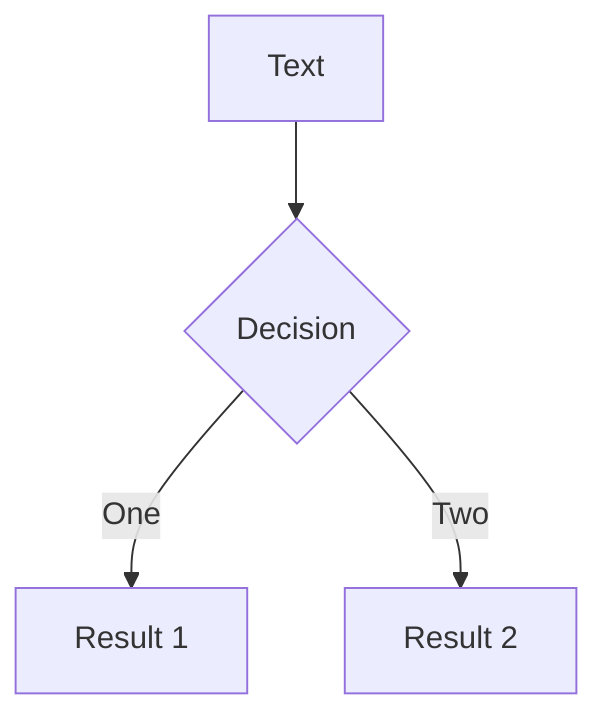

# Nix

How to build software from the future

<!-- --- -->
<!-- src: ./pages/what_is_nix.md -->
<!-- --- -->

---
layout: center
---

# Core Idea of Nix

<br/>
<br/>

> Everything on your computer implicitly depends on a bunch of other things on your computer

<br/>
<br/>

<v-clicks>

- All software is a graph of dependencies
- This graph is mostly implicit
- Nix forces this graph to be explicit

</v-clicks>

---
layout: center
---


---
layout: center
---


---
layout: center
---

# Four key ideas:

<v-clicks>

- Store
- Language
- Derivation
- Sandboxing

</v-clicks>




---
layout: two-cols
---

# The Nix Store

<br/>

<v-clicks>

When nix is installed, a special directory, `/nix/store` is created

This directory is just a graph database

Every sub-directory is a node

<div>

Example:

```bash
/nix/store/q1i8hccfgx0al5jhx5n610jwwqa3jijx-git-2.38.1
```

</div>

Everything under a `node` directory is considered immutable

In a node, there may be references to paths in other nodes, creating an edge

</v-clicks>


::right::

```bash
/nix/store/9xfad3b5z4y00mzmk2wnn4900q0qmxns-glibc-2.35-224
/nix/store/f1n473kbcxxr38f7amwf4sxyi56mfczh-expat-2.5.0
/nix/store/fblaj5ywkgphzpp5kx41av32kls9256y-zlib-1.2.13
/nix/store/wim4mqpn8lxhhr10p2kd070hyj152lil-bash-5.1-p16
/nix/store/65cp4izx3bllnwqn7c7dhrq9h9gmjkal-python3-3.10.9
/nix/store/88k0f4k4hb13mjqm1xc0sysjysrrw813-gzip-1.12
/nix/store/8n4g9jl8s2v8sla6gffa03gy1gkk1pqm-perl5.36.0-URI-5.05
/nix/store/a19azdhwnvmksbpfz0crb4d1l9l19b2d-git-2.38.1-doc
/nix/store/ncwm1bgg4x4k7ixjni5bxj3v7b2x5lyb-perl5.36.0-FCGI-0.79
/nix/store/k32xzhjqyvgmjnkckvk2h3gbjpdb3hfl-perl5.36.0-HTML-Parser-3.75
/nix/store/w2gxv2p9831ypflpk61l7sjzi8j05agj-perl5.36.0-CGI-4.51
/nix/store/a509h53d4vki546clzig63kh6h4qyps4-perl5.36.0-CGI-Fast-2.15
...
...
/nix/store/xryxkg022p5vnlyyyx58csbmfc7ydsdp-curl-7.86.0
/nix/store/z6976dw306w5fn1d4sg7xwc1x3cszy1s-perl5.36.0-FCGI-ProcManager-0.28
/nix/store/z97bsdbkh6b60xpi12sqi6a0d28ql8cy-pcre2-10.40
/nix/store/q1i8hccfgx0al5jhx5n610jwwqa3jijx-git-2.38.1
```

<sub>Some of the direct dependencies for git</sub>


---
layout: center
---

<code>
/nix/store/<b>q1i8hccfgx0al5jhx5n610jwwqa3jijx</b>-git-2.38.1
</code>

<!-- --- -->
<!-- src: ./pages/nix_philosophy.md -->
<!-- --- -->
